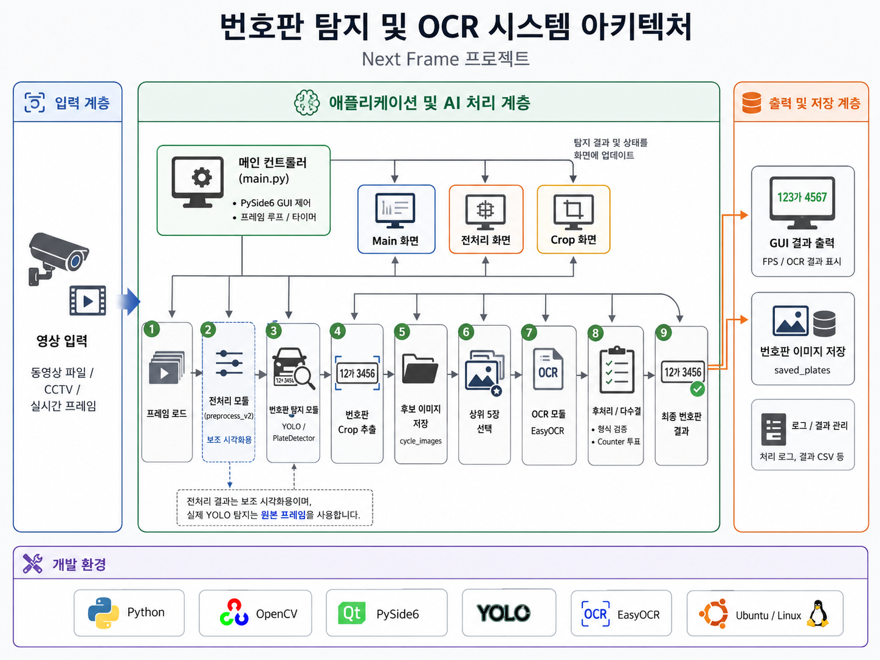
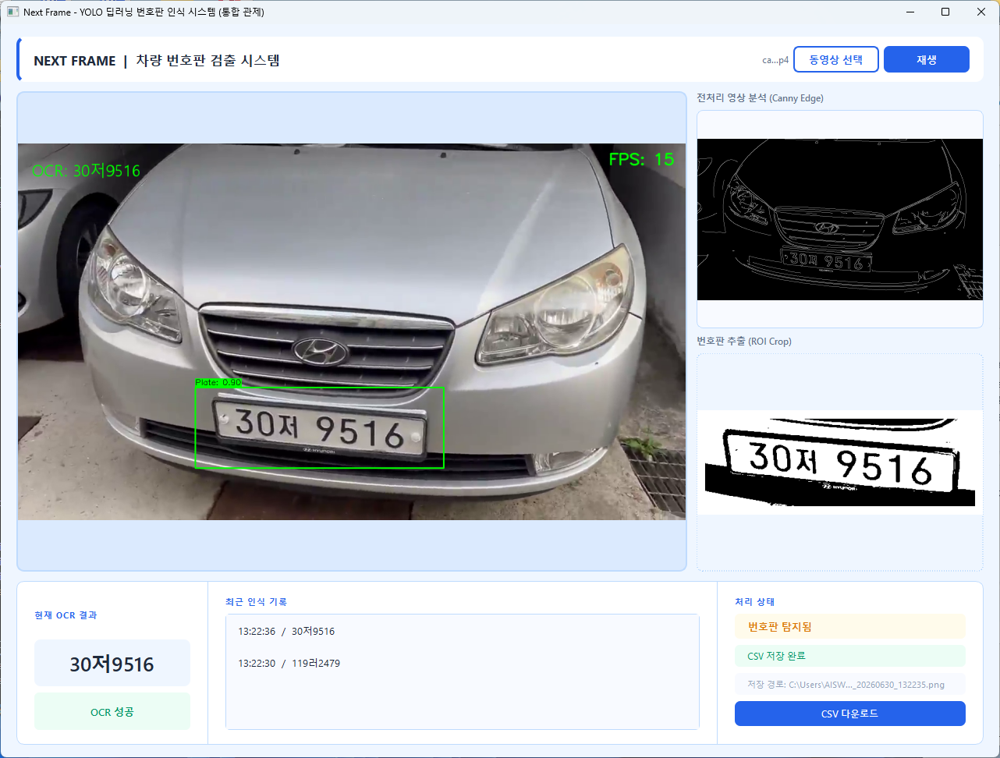

# 🚗 NextFrame - AI 번호판 탐지 및 OCR 시스템

> YOLO 기반 번호판 탐지와 EasyOCR을 활용하여 차량 번호판을 인식하고 GUI를 통해 실시간으로 결과를 확인할 수 있는 번호판 인식 시스템입니다.

---

## 📌 프로젝트 소개

본 프로젝트는 차량 영상에서 번호판을 자동으로 탐지하고(OCR), 인식 결과를 GUI와 CSV 파일로 제공하는 AI 기반 번호판 인식 시스템입니다.

YOLO를 이용한 번호판 검출, EasyOCR을 이용한 문자 인식, 후처리 및 다수결 투표를 통해 OCR 정확도를 향상시키고 하나의 GUI에서 전체 처리 과정을 확인할 수 있도록 구현했습니다.

---

## 🏗 시스템 아키텍처



---

## 🖥 실행 화면



---

## ✨ 주요 기능

- YOLO 기반 번호판 탐지
- EasyOCR 기반 번호판 문자 인식
- 번호판 Crop 추출
- OCR 결과 형식 검증
- 후보 이미지 다수결(Majority Voting)
- GUI 실시간 출력
- CSV 결과 저장
- 번호판 이미지 저장

---

## ⚙ 처리 과정

```
영상 입력
   ↓
OpenCV 전처리
   ↓
YOLO 번호판 탐지
   ↓
번호판 Crop
   ↓
EasyOCR 문자 인식
   ↓
정규식 검증
   ↓
다수결 투표
   ↓
GUI 출력 및 CSV 저장
```

---

## 🛠 기술 스택

| 분야 | 기술 |
|------|------|
| Language | Python |
| Object Detection | YOLO (Ultralytics) |
| OCR | EasyOCR |
| Image Processing | OpenCV |
| GUI | PySide6 |
| Deep Learning | PyTorch |
| OS | Ubuntu Linux |
| 협업 | GitHub |

---

## 📂 프로젝트 구조

```

nextframe_opencv
│
├── README.md
├── images   
│     ├── architecture.png
│     ├── gui.png
│     └── detection.png
└── nextframe
    ├── best.pt                      # YOLO 학습 모델
    ├── main.py                      # 메인 GUI 및 시스템 제어
    ├── detection.py                 # YOLO 번호판 탐지
    ├── ocr.py                       # EasyOCR 문자 인식
    ├── preprocess_v2.py             # 영상 전처리
    ├── plate_detector.py            # 번호판 탐지 모듈
    ├── train.py                     # YOLO 모델 학습
    ├── ui_layout.py                 # GUI 레이아웃
    ├── main_window.ui               # Qt Designer UI
    ├── saved_plates/                # 번호판 이미지 저장
    ├── YOLOdataset/                 # YOLO 학습 데이터셋
    └── runs/                        # YOLO 학습 결과
```

---
## 👥 팀 구성 및 역할

| 이름 | 역할 | 담당 업무 |
|------|------|-----------|
| 양진희 | 팀장 | 프로젝트 총괄, YOLO 모델 학습 및 전처리, 시스템 통합, 발표 |
| 이장우 | 팀원 | 메인 프로그램 통합, Ubuntu 공용 서버 및 협업 환경 구축 |
| 송현우 | 팀원 | EasyOCR 기반 문자 인식(OCR) 구현 및 GPU 환경 설정 |
| 김기욱 | 팀원 | YOLO 모델 학습 및 추론, 번호판 Crop 기능 구현 |
| 노건우 | 팀원 | PySide6 GUI 구현, 개발 환경 설정, 결과 영상 촬영 |

---

## 🔍 주요 구현 내용

### YOLO 번호판 탐지

- 번호판 객체 탐지
- 동적 Padding 적용
- 번호판 Crop 생성
- 신뢰도 기반 Bounding Box 출력

### OCR 문자 인식

- EasyOCR 적용
- AllowList 적용
- 번호판 형식 검증
- 일반 번호판 및 사업용 번호판 지원

### 후처리

- 형식 검증(정규식)
- 후보 이미지 5장 선정
- Counter 기반 다수결 투표
- 최종 번호판 결정

### GUI

- 원본 영상 출력
- 전처리 화면
- Crop 화면
- OCR 결과 출력
- FPS 표시
- CSV 저장


---

## ⚠ 한계점

- 원거리 번호판 탐지 성능 저하
- Ubuntu 환경에서 FPS 저하
- 반사광 및 흔들림 환경에서 Flickering 발생
- 하드웨어 환경에 따른 성능 차이

---

## 🚀 향후 개선

- ByteTrack / DeepSORT Tracking 적용
- TensorRT / ONNX 경량화
- AI Hub 데이터 추가 학습
- 야간 및 악천후 데이터 확대
- OCR 정확도 개선

---

## 📸 프로젝트 결과

- 번호판 자동 탐지
- OCR 문자 인식
- GUI 실시간 출력
- 번호판 이미지 저장
- CSV 저장 기능 구현

## 🚀 실행 방법

### 1. 저장소 클론

```bash
git clone <Repository_URL>
cd NEXTFRAME
```

### 2. Conda 가상환경 생성

```bash
conda create -n nextframe python=3.12
```

### 3. Conda 가상환경 활성화

```bash
conda activate project1
```

### 4. 필수 라이브러리 설치

```bash
pip install -r requirements.txt
```

### 5. 프로그램 실행

```bash
python main.py
```

프로그램 실행 후 GUI에서 차량 영상을 재생하면 번호판 탐지 및 OCR 결과를 실시간으로 확인할 수 있습니다.